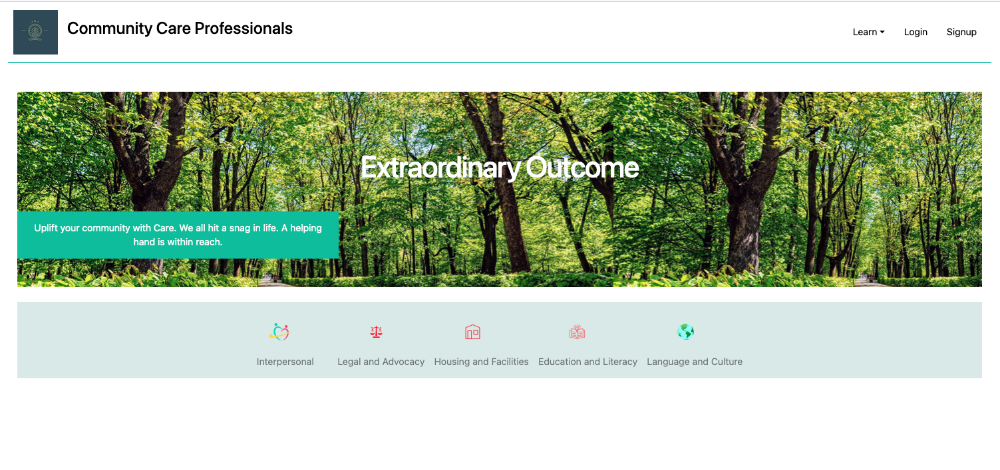
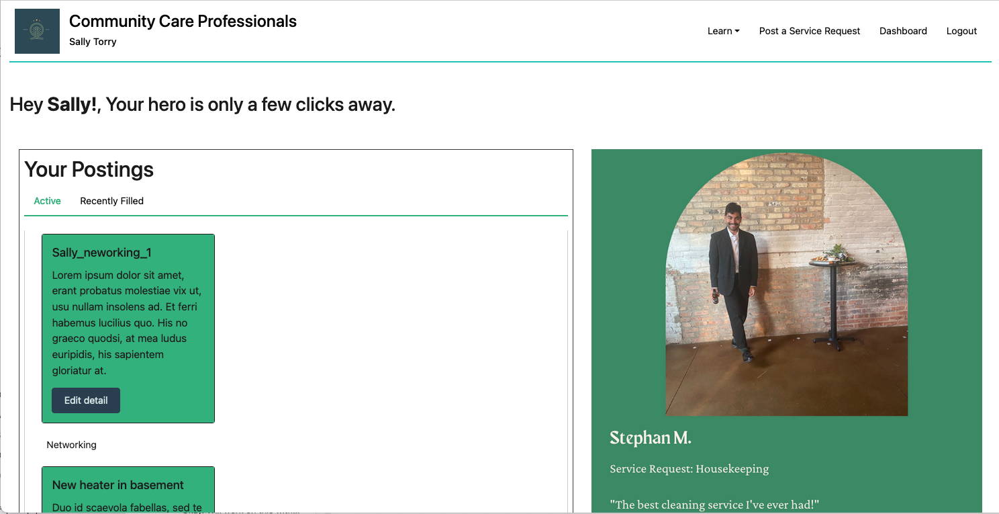
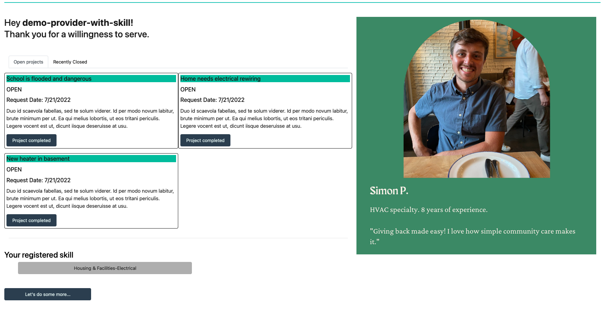
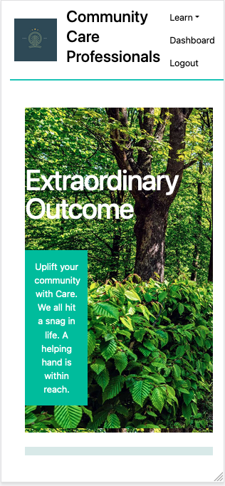

# Community Care Professionals

<table>
<tr>
<td>
  Your superheroes don't always have to be on the big screens or come to you through a streaming service. With our Community Care Professionals (CCPro) app, that hero may be someone next door, or better yet, the one you see in the mirror. With this app, we are uniting the world through Care and offering everyone the opportunity to bless or be blessed -- all pro bono. This app runs purely as a web application and requires no installation on your device. Yes! This is our little way of bringing Care to you and people all over. Why don't you subscribe and do the same. 
</td>
</tr>
</table>

## Table of contents

- [Demo](#Demo)
- [Mobile-Support](#Mobile-Support)
- [Development](#Development)
- [Future-enhancements](#Future-enhancements)
- [Licensing Information](#license)

## Demo

To view this web app: https://sleepy-bayou-09403.herokuapp.com/

### Landing-Page
To better match a professional with a service consumer, each user must establish a profile. That's where the matching begins...

### Consumer-dashboard

A service consumer sees all active service request, but also the opportunity to create new ones. Without you creating those service requests, there can be no heroes. 

### Professional dashboard

A service professional sees all service requests that are being worked on, along with jobs that have been closed. 

## Mobile support

This app is compatible with all modern devices and web browsers of all sizes. It is what we describe as responsive!

## Development

This app was built collaboratively as a first-project by a team of students from the Northwestern University Coding boot camp.

Technologies used:

- JavaScript
- Bootstrap CSS
- Node.js
- HTML
- Express
- Handlebars
- npm

## Future enhancements

- Provide an interface for admin to add and remove categories and skills
- Improve algorithm for matching professionals with service consumers
- Partner with apps like upworks to provide some form of incentive to their registered professionals to offer work pro-bono

## License

The GNU GPL is the most widely used free software license and has a strong copyleft requirement. When distributing derived works, the source code of the work must be made available under the same license. There are multiple variants of the GNU GPL, each with different requirements.

For more details on this license, go to http://choosealicense.com/licenses/gpl-2.0/

## Questions
Please contacts us through Github or via email. 

  

    Tony P:
    <a href='https://github.com/tonypoku-ghub' target='_blank'> Github</a>
    <a
      href='mailito:anthonypoku2022@u.northwestern.edu?subject=Web%20Inquiry'
    >Email</a>
  

  

    Blaise S:
    <a href='https://github.com/Cmacgaffey' target='_blank'>Github</a>
    <a href='mailito:cmacgaffey@gmail.com?subject=Web%20Inquiry'>Email</a>
  

  

    Colin M:
    <a href='https://github.com/BlaiseSiocon' target='_blank'>Github</a>
    <a href='mailito:sioconblaise@gmail.com?subject=Web%20Inquiry'>Email</a>
  

  

    Elia M:
    <a href='https://github.com/EliaMart' target='_blank'>Github</a>
    <a
      href='mailito:eliahaydeemartinez@gmail.com?subject=Web%20Inquiry'
    >Email</a>
  

